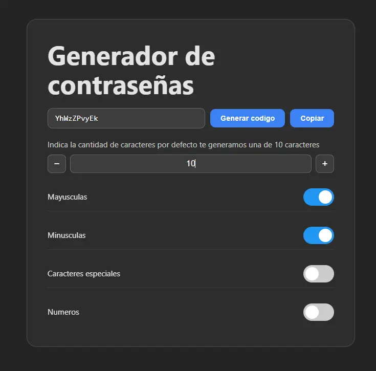

# Generador de Contraseñas

Una aplicación web para generar contraseñas seguras y personalizables, construida con **React**, **TypeScript** y **Vite**.



## Caracteristicas

- Genera contraseñas aleatorias con un solo clic
- Configura la longitud de la contraseña
- Elige qué tipos de caracteres incluir:
  - Mayusculas (A-Z)
  - Minusculas (a-z)
  - Numeros (0-9)
  - Caracteres especiales (!@#$%...)
- Copia la contraseña al portapapeles con un clic
- Interfaz en español con soporte para internacionalización (i18n)

## Tecnologias

- [React](https://react.dev/) — libreria de UI
- [TypeScript](https://www.typescriptlang.org/) — tipado estático
- [Vite](https://vite.dev/) — bundler y servidor de desarrollo
- [i18next](https://www.i18next.com/) — internacionalización

## Instalacion

```bash
npm install
npm run dev
```

## Uso

1. Ajusta la cantidad de caracteres con los botones `−` / `+` o escribe directamente el número.
2. Activa o desactiva los tipos de caracteres con los switches.
3. Presiona **Generar codigo** para crear una contraseña.
4. Presiona **Copiar** para copiarla al portapapeles.
